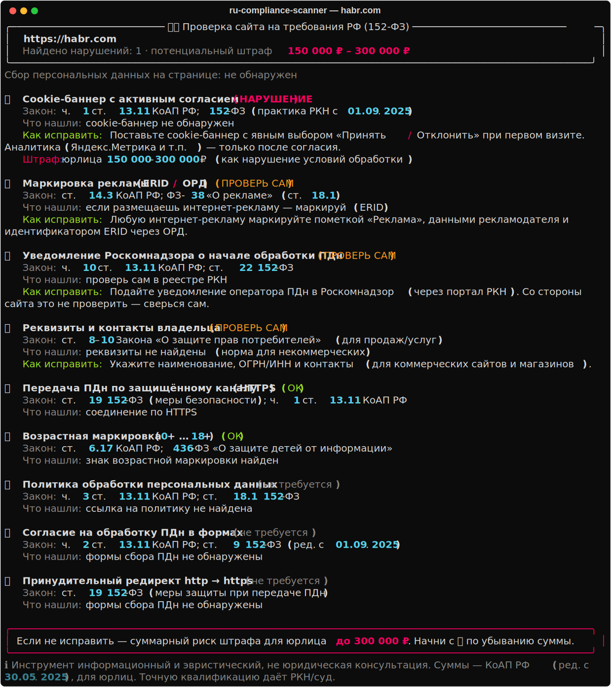
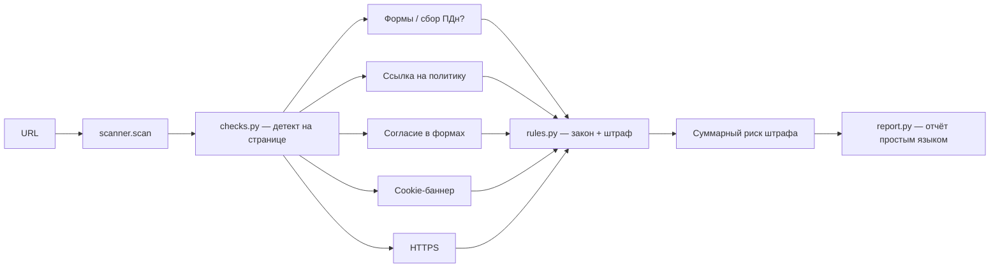

# 🇷🇺 RU Compliance Scanner


Проверяет сайт на соответствие требованиям законодательства РФ (прежде всего
**152-ФЗ «О персональных данных»**), показывает что не так, как это исправить и
**какой штраф** грозит, если не починить.

> ⚠️ **Дисклеймер:** инструмент **информационный и эвристический**, это **не
> юридическая консультация**. Суммы штрафов — по КоАП РФ (ст. 13.11, ред. с
> 30.05.2025), приведены для юрлиц. Точную квалификацию определяет Роскомнадзор/суд.
> Проверяй свои или разрешённые сайты.

## Демо



## Как работает



## Что проверяет

| Требование | Закон | Штраф (юрлица) |
|------------|-------|----------------|
| **Политика обработки ПДн** (ссылка в футере) | ч. 3 ст. 13.11 КоАП | 30 000 – 60 000 ₽ |
| **Согласие в формах** (отдельный непредзаполненный чекбокс) | ч. 2 ст. 13.11 КоАП | 300 000 – 500 000 ₽ |
| **Cookie-баннер** с активным согласием | ч. 1 ст. 13.11 КоАП | 150 000 – 300 000 ₽ |
| **HTTPS** на страницах с формами | ст. 19 152-ФЗ | 150 000 – 300 000 ₽ |
| **Редирект http → https** (если есть формы) | ст. 19 152-ФЗ | 150 000 – 300 000 ₽ |
| **Уведомление РКН** о начале обработки | ч. 10 ст. 13.11 КоАП | 100 000 – 300 000 ₽ *(проверь сам)* |
| **Возрастная маркировка** (0+ … 18+) | ст. 6.17 КоАП; 436-ФЗ | 20 000 – 50 000 ₽ *(если применимо)* |
| **Маркировка рекламы** (ERID / ОРД) | ст. 14.3 КоАП; ФЗ-38 | 100 000 – 500 000 ₽ *(если применимо)* |
| **Реквизиты владельца** (для магазинов) | ЗоЗПП | — |

Сканер сам определяет, **собирает ли сайт ПДн** (есть ли формы), и применяет
требования по контексту. Он также:
- **находит трекеры/аналитику** (Яндекс.Метрика, GA/GTM, VK-пиксель и др.) и реально
  выставленные cookie — именно они рождают обязанность cookie-согласия;
- **политику проверяет «по-взрослому»** — заходит по ссылке (и пробует типовые пути
  `/privacy`, `/policy`…), смотрит, открывается ли и есть ли обязательные блоки;
- с флагом `--render` **рендерит страницу через headless Chrome** и видит контент,
  который подгружается JS (баннеры, формы, скрипты) — точнее и стабильнее.

В конце считает **суммарный потенциальный штраф**.

## Установка

```bash
cd ru-compliance-scanner
python3 -m venv .venv && source .venv/bin/activate
pip install -r requirements.txt
```

## Использование

```bash
python cli.py                      # интерактивно: вводи адреса по одному
python cli.py example.ru           # разбор простым языком + штрафы
python cli.py example.ru --json
python cli.py example.ru --html    # HTML-заключение (report_<host>.html)
python cli.py example.ru --pdf     # PDF-заключение (через Chrome)
python cli.py example.ru --render  # рендер через headless Chrome (видит JS-контент)

# Batch — несколько сайтов разом + сводная таблица рисков
python cli.py a.ru b.ru c.ru
python cli.py --file sites.txt

# API
uvicorn api.main:app
curl "localhost:8000/scan?url=example.ru"
```

### Telegram-бот

Кидаешь боту ссылку → он присылает нарушения со штрафами.

```bash
export BOT_TOKEN=...   # токен от @BotFather
python bot.py
```

## Структура

| Путь | Роль |
|------|------|
| `rucompliance/rules.py` | справочник требований + суммы штрафов (КоАП) |
| `rucompliance/checks.py` | эвристический детект признаков на странице (BeautifulSoup) |
| `rucompliance/scanner.py` | оркестратор + подсчёт риска штрафа |
| `rucompliance/report.py` | вывод простым языком (rich) |
| `rucompliance/html_report.py` | HTML/PDF-заключение |
| `cli.py` / `api/main.py` / `bot.py` | CLI, HTTP-эндпоинт и Telegram-бот |

## Дорожная карта

- [x] HTML / PDF-заключение
- [x] Умная проверка политики (заход по ссылке + содержимое)
- [x] Возрастная маркировка (436-ФЗ) и маркировка рекламы (ERID)
- [x] Batch-режим и Telegram-бот
- [ ] Учёт ИП/должностных лиц в расчёте штрафа
- [ ] Парсинг директив (cookie-категории, ОРД-токены)
